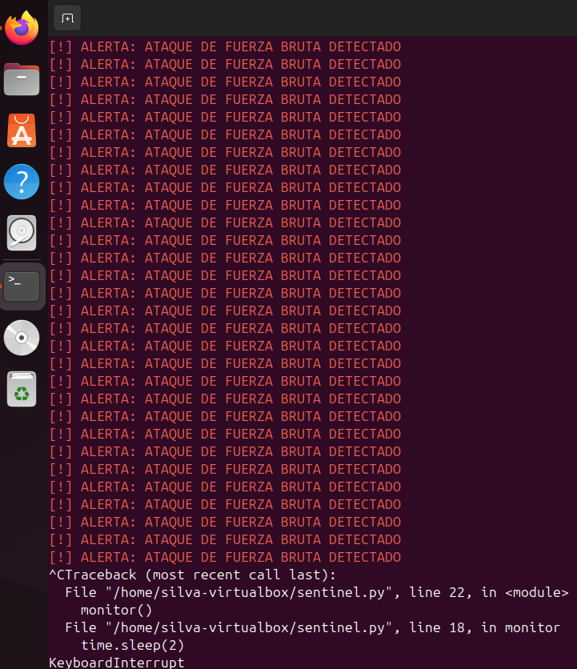
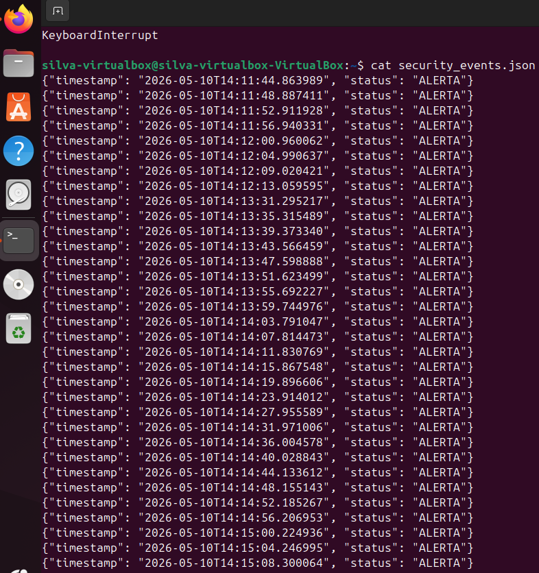

# SSH Brute Force Detection Lab

Monitorización de autenticación SSH y detección básica de ataques de fuerza bruta utilizando Linux logs y automatización con Python.

---

# 📌 Descripción del Proyecto

Este laboratorio simula intentos de acceso SSH no autorizados contra un servidor Ubuntu y demuestra cómo los eventos de autenticación pueden ser monitorizados, filtrados y analizados en tiempo real.

El objetivo principal del proyecto es desarrollar una comprensión práctica de:

- Logs de autenticación en Linux
- Monitorización de eventos SSH
- Detección básica de fuerza bruta
- Filtrado y análisis de logs
- Automatización con Python
- Fundamentos de SOC y SecOps
- Telemetría de seguridad

Este proyecto fue desarrollado como parte de mi formación práctica en Ciberseguridad y SecOps.

---

# 🖥️ Entorno del Laboratorio

| Componente | Función |
|---|---|
| Ubuntu 24.04 | Sistema objetivo / fuente de logs |
| Kali Linux | Simulación de ataques |
| OpenSSH Server | Servicio de autenticación |
| Python 3 | Motor de monitorización |
| auth.log | Fuente principal de telemetría |

---

# 🌐 Configuración de Red

| Máquina | Dirección IP |
|---|---|
| Ubuntu Server | 10.0.2.15 |
| Kali Linux | Red interna VirtualBox |

---

# ⚔️ Simulación del Ataque

Se realizaron múltiples intentos de autenticación SSH inválidos desde Kali Linux para generar eventos de seguridad dentro del archivo `/var/log/auth.log`.

## Ejemplo de ataque SSH

```bash
ssh hacker@10.0.2.15
```

---

# 📡 Monitorización en Tiempo Real

## Visualización continua de logs

```bash
sudo tail -f /var/log/auth.log
```

## Filtrado de eventos de autenticación fallida

```bash
grep -a "Failed password" /var/log/auth.log
```

## Conteo de intentos fallidos

```bash
grep -a "Failed password" /var/log/auth.log | wc -l
```

## Identificación de IPs con más intentos

```bash
grep -a "Failed password" /var/log/auth.log | awk '{print $(NF-3)}' | sort | uniq -c | sort -nr
```

---

# 🚨 Ejemplo de Detección

```text
Failed password for invalid user hacker from 10.0.2.15
```

---

# 🐍 Motor de Detección en Python

El script Python monitoriza continuamente el archivo de autenticación y genera alertas cuando detecta intentos sospechosos de acceso SSH.

## Ejemplo de salida del sistema

```text
[!] ALERTA: ATAQUE DE FUERZA BRUTA DETECTADO
```

---

# 📂 Telemetría en JSON

Los eventos detectados son exportados a un archivo `security_events.json`, permitiendo futuras integraciones con plataformas SIEM como:

- Wazuh
- Splunk
- Elastic Stack
- Microsoft Sentinel

## Ejemplo de evento JSON

```json
{
  "timestamp": "2026-05-10T14:15:08",
  "status": "ALERT",
  "attack_type": "SSH Brute Force"
}
```

---

# 📸 Evidencias del Laboratorio

## Detección en Tiempo Real



## Eventos de Seguridad en JSON



---

# 🧠 Conceptos Practicados

- Linux log analysis
- SSH authentication monitoring
- Brute force detection
- Real-time monitoring
- Security telemetry
- Troubleshooting básico
- Detección de eventos
- Fundamentos de SOC
- Automatización con Python

---

# 🔒 Mejoras Futuras

Próximas implementaciones previstas:

- Integración con Wazuh
- Alertas automáticas
- Detección por thresholds
- Integración Syslog
- Fail2Ban
- MITRE ATT&CK Mapping
- Dashboard de monitorización
- Enriquecimiento de eventos

---

# 📚 Lessons Learned

Durante este laboratorio aprendí:

- Cómo funcionan los logs de autenticación Linux
- Cómo SSH registra eventos de acceso
- Fundamentos de detección de fuerza bruta
- Monitorización en tiempo real con Python
- Estructuración de eventos en JSON
- Importancia de la telemetría en entornos SOC
- Conceptos básicos de Detection Engineering

---

# 👨‍💻 Autor

Fernando Silva   
Barcelona, España

## Intereses profesionales

- SecOps
- SOC Operations
- Detection Engineering
- Linux Security
- Python Automation
- Cybersecurity


Version 1.0 — Initial SSH monitoring prototype